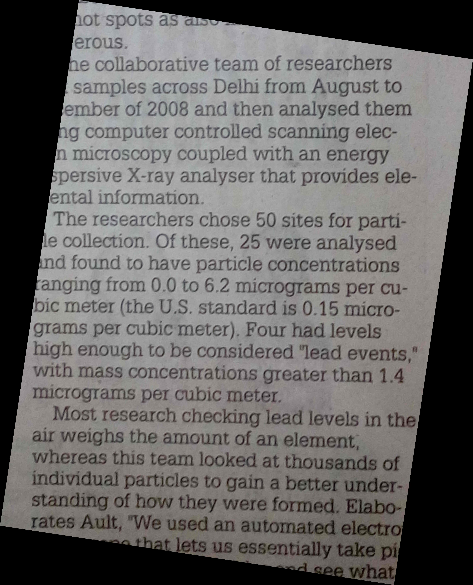

# Deskew

//Note: Skew is measured in degrees. Deskewing is a process whereby skew is removed by rotating an image by the same amount as its skew but in the opposite direction. This results in a horizontally and vertically aligned image where the text runs across the page rather than at an angle.

## Skew detection and correction in images containing text


<h5>Image with skew</h5>

<h5>Image after deskew</h5>

## Cli usage

Get the skew angle:

```
deskew input.png
```

Deskew an image:

```
deskew --output output.png input.png
```

# Lib usage

scikit-image:

```python
import numpy as np
from skimage import io
from skimage.color import rgb2gray
from skimage.transform import rotate

from deskew import determine_skew

image = io.imread('input.png')
grayscale = rgb2gray(image)
angle = determine_skew(grayscale)
rotated = rotate(image, angle, resize=True) * 255
io.imsave('output.png', rotated.astype(np.uint8))
```

OpenCV:

```python
import math
from typing import Tuple, Union

import cv2
import numpy as np

from deskew import determine_skew


def rotate(
        image: np.ndarray, angle: float, background: Union[int, Tuple[int, int, int]]
) -> np.ndarray:
    old_width, old_height = image.shape[:2]
    angle_radian = math.radians(angle)
    width = abs(np.sin(angle_radian) * old_height) + abs(np.cos(angle_radian) * old_width)
    height = abs(np.sin(angle_radian) * old_width) + abs(np.cos(angle_radian) * old_height)

    image_center = tuple(np.array(image.shape[1::-1]) / 2)
    rot_mat = cv2.getRotationMatrix2D(image_center, angle, 1.0)
    rot_mat[1, 2] += (width - old_width) / 2
    rot_mat[0, 2] += (height - old_height) / 2
    return cv2.warpAffine(image, rot_mat, (int(round(height)), int(round(width))), borderValue=background)

image = cv2.imread('input.png')
grayscale = cv2.cvtColor(image, cv2.COLOR_BGR2GRAY)
angle = determine_skew(grayscale)
rotated = rotate(image, angle, (0, 0, 0))
cv2.imwrite('output.png', rotated)
```

Inspired by Alyn: https://github.com/kakul/Alyn
